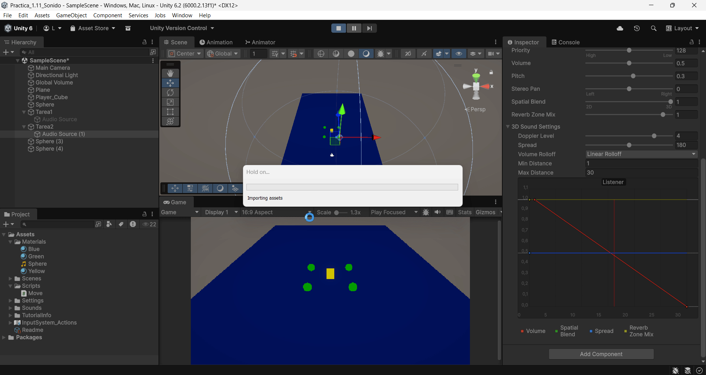
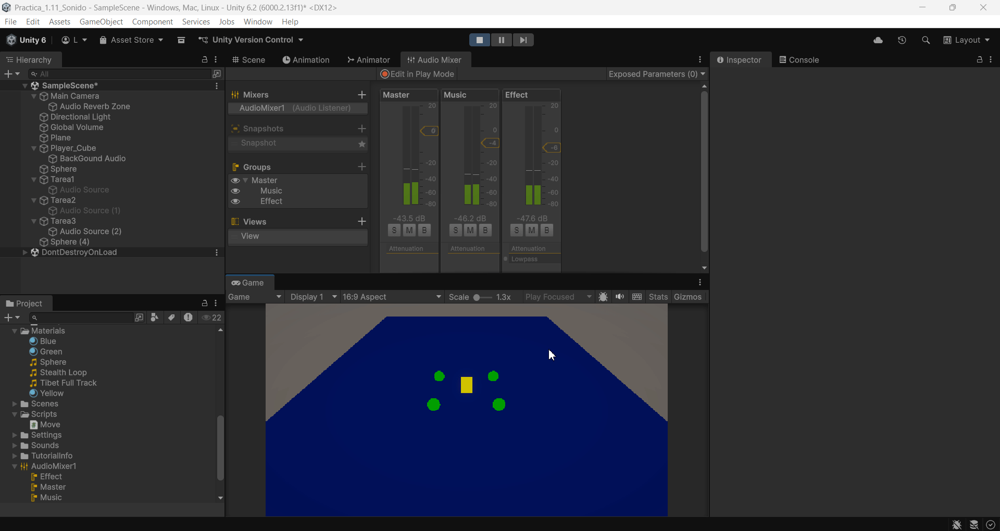

FDV_Sonido

```
>> PRACTICA:   Unity Project Sound
>> COMPONENTE: XueMei Lin
>> GITHUB:     https://github.com/XueMei-L/FDV_Sonido.git
>> Versión:    1.0.0
```

# Objetivo
Aprender a manejar el tema de sonido en Unity.

## Parte 1: Componente AudioSource

### Tarea1: Configurar una escena simple en 3D con un objeto cubo que hará de player y varias esferas de color. Agregar un objeto AudioSource desde el menú GameObject → Audio. Seleccionar un clip de audio en algún paquete de la Asset Store de tu gusto y adjuntarlo a una esfera. El audio se debe reproducir en cuanto se carga la escena y en bucle.

1. Crear un cubo como player y crear varias esferas de color
2. Buscar un audio en Asset Store y configuración de AudioSource
3. Cuando dar play, suena el audio en bucle, se puede configurar pitch y volume para controlar la velocidad y volumen del audio.


### Tarea2: En la escena anterior crea un objeto con una fuente de audio a la que le configures el efecto Doppler elevado y que se mueva al pulsar la tecla m a una velocidad alta. Explica los efectos que produce: 
### Incrementar el valor del parámetro Spread.
### Cambiar la configuración de Min Distance y Max Distance
### Cambiar la curva de Logarithmic Rollof a Linear Rollof

1. Reutilizar una esfera del escenario anterior
2. Configurar que Spatial Blend es 3D, en 2D no se cambia el sonido
3. Modificar el valor de Doppler Level = 3
4. Modificar valor de Spread = 180
5. Modificar Min Distance y Max Distance
6. Modificar Volume Rolloff = Linear Rolloff
7. Crear el **script** "Move.cs" para asignar a la esfera mensionada.
   
*Move.cs*

```
using UnityEngine.InputSystem;

public class FastMover : MonoBehaviour
{
    public float speed = 10f;

    void Update()
    {
        if (Keyboard.current.mKey.isPressed)
        {
            // Mover hacia delante
            transform.Translate(Vector3.forward * speed * Time.deltaTime);
        }
    }
}

```


Resultado：
No habrá sonido cuando está fuera del rango.


### El uso de Reverb Zone
**Reverb Zone** es una "zona de efecto de reverberación de sonido" que produce un efecto de eco o reverberación cuando la fuente de audio ingresa a esta zona.


## Parte 2: Audio Mixer
1. Crear un mixer
2. Crear dos grupos, uno para la música del fondo y otro para el efecto de la esfera.
3. Poner efecto **lowpass** para el efecto de musica para que suena mejor.


Resultado:
