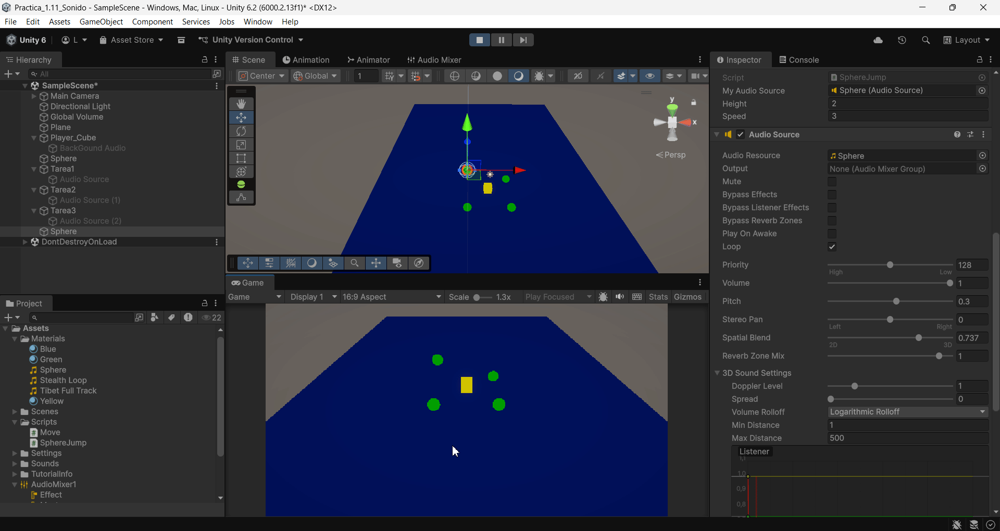
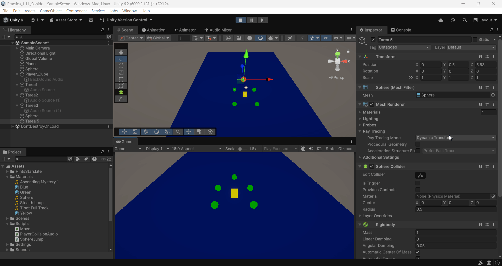
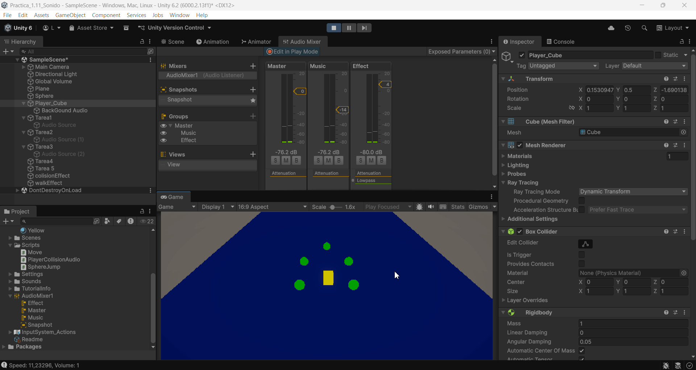

FDV_Sonido

```
>> PRACTICA:   Unity Project Sound
>> COMPONENTE: XueMei Lin
>> GITHUB:     https://github.com/XueMei-L/FDV_Sonido.git
>> Versión:    1.0.0
```

# Objetivo
Aprender a manejar el tema de sonido en Unity.

## Parte 1: Componente AudioSource

### Tarea1: Configurar una escena simple en 3D con un objeto cubo que hará de player y varias esferas de color. Agregar un objeto AudioSource desde el menú GameObject → Audio. Seleccionar un clip de audio en algún paquete de la Asset Store de tu gusto y adjuntarlo a una esfera. El audio se debe reproducir en cuanto se carga la escena y en bucle.

1. Crear un cubo como player y crear varias esferas de color
2. Buscar un audio en Asset Store y configuración de AudioSource
3. Cuando dar play, suena el audio en bucle, se puede configurar pitch y volume para controlar la velocidad y volumen del audio.


### Tarea2: En la escena anterior crea un objeto con una fuente de audio a la que le configures el efecto Doppler elevado y que se mueva al pulsar la tecla m a una velocidad alta. Explica los efectos que produce: 
1. Incrementar el valor del parámetro Spread.
2.  Cambiar la configuración de Min Distance y Max Distance
3. Cambiar la curva de Logarithmic Rollof a Linear Rollof

### La realización de la tarea2
1. Reutilizar una esfera del escenario anterior
2. Configurar que Spatial Blend es 3D, en 2D no se cambia el sonido
3. Modificar el valor de Doppler Level = 3
4. Modificar valor de Spread = 180
5. Modificar Min Distance y Max Distance
6. Modificar Volume Rolloff = Linear Rolloff
7. Crear el **script** "Move.cs" para asignar a la esfera mensionada.
   
*Move.cs*

```
using UnityEngine.InputSystem;

public class FastMover : MonoBehaviour
{
    public float speed = 10f;

    void Update()
    {
        if (Keyboard.current.mKey.isPressed)
        {
            // Mover hacia delante
            transform.Translate(Vector3.forward * speed * Time.deltaTime);
        }
    }
}

```


Resultado：
No habrá sonido cuando está fuera del rango.


### El uso de Reverb Zone
**Reverb Zone** es una "zona de efecto de reverberación de sonido" que produce un efecto de eco o reverberación cuando la fuente de audio ingresa a esta zona.


## Parte 2: Audio Mixer
1. Crear un mixer
2. Crear dos grupos, uno para la música del fondo y otro para el efecto de la esfera.
3. Poner efecto **lowpass** para el efecto de musica para que suena mejor.


Resultado:


## Parte 3: Audio vía Scripts
### Tarea4: Implementar un script que al pulsar la tecla p accione el movimiento de una esfera en la escena y reproduzca un sonido en bucle hasta que se pulse la tecla s.
1. Crear script SphereJump para manejar cuando pulsa la tecla p, la esfera salta y cuando pulsa la tecla s, para el salto.
```
using UnityEngine;
using UnityEngine.InputSystem;
public class SphereJump : MonoBehaviour
{
    public AudioSource _MyAudioSource;
    public float height = 2f;
    public float speed = 3f;

    private bool isJumping = false;
    private Vector3 startPos;

    void Start()
    {
        _MyAudioSource = GetComponent<AudioSource>();
        _MyAudioSource.loop = true;
        _MyAudioSource.Stop();
        startPos = transform.position;
    }

    void Update()
    {
        if (Keyboard.current.pKey.wasPressedThisFrame)
        {
            isJumping = true;

            if (!_MyAudioSource.isPlaying)
                _MyAudioSource.Play();
        }

        if (Keyboard.current.sKey.wasPressedThisFrame)
        {
            isJumping = false;
            _MyAudioSource.Stop();
            transform.position = startPos;
        }

        if (isJumping)
        {
            float yOffset = Mathf.Abs(Mathf.Sin(Time.time * speed)) * height;
            transform.position = new Vector3(
                startPos.x,
                startPos.y + yOffset,
                startPos.z
            );
        }
    }
}

```

2. Configuración de componentes de esfera


Resultado:


### Tarea5:  Implementar un script en el que el cubo-player al colisionar con las esferas active un sonido.
1. Crear un script para controlar el movimiento del cubo-player
2. En el mismo script hace que cuando choca con algo produce una vez el sonido efecto utilizando el método *PlayOneShot()*
3. Añadir la conlisión entre dos objetos, cubo-player y esfera.
*PlayerCollisionAudio.cs*
```
using UnityEngine;
using UnityEngine.InputSystem;

public class PlayerCollisionAudio : MonoBehaviour
{
    public AudioSource audioSource;
    public float moveSpeed = 5f;

    private Rigidbody rb;


    void Start()
    {
        rb = GetComponent<Rigidbody>();
        audioSource = GetComponent<AudioSource>();
        if(audioSource != null)
            audioSource.Stop();
    }

    void Update()
    {
        // horizontal y vertical
        float h = 0f;
        float v = 0f;

        if (Keyboard.current.wKey.isPressed) v += 1f;
        if (Keyboard.current.sKey.isPressed) v -= 1f;
        if (Keyboard.current.aKey.isPressed) h -= 1f;
        if (Keyboard.current.dKey.isPressed) h += 1f;

        Vector3 move = new Vector3(h, 0f, v).normalized * moveSpeed * Time.deltaTime;

        // move Rigidbody
        rb.MovePosition(rb.position + move);
    }

    void OnCollisionEnter(Collision collision)
    {
        // para que cuando choca con el suelo no produce ningun sonido
        if (collision.gameObject.CompareTag("Ground")) return;
        // solo una vez
        audioSource.PlayOneShot(audioSource.clip);
    }
}
```


Resultado:
La esfera como tiene Kinematic activado no se mueve.



### Tarea6: Modificar el script anterior para que según la velocidad a la que se impacte, el cubo lance un sonido más fuerte o más débil.
1. Cuando el cubo colisiona con la esfera, calcula la velocidad, para controlar el sonido.
```
float impactSpeed = ((transform.position - lastPosition) / Time.deltaTime).magnitude;
            float volume = Mathf.Clamp(impactSpeed * volumeMultiplier, 0.1f, 1f);
            Debug.Log("Speed: " + impactSpeed + ", Volume: " + volume);
```

Resultado:
Cuando choca rápidamente con la esfera, produce un volumen a 1 como máximo, y cuando choca lentamente con la esfera, produce un sonido más pequeño.


### Tarea7: Agregar un sonido de fondo a la escena que se esté reproduciendo continuamente desde que esta se carga. Usar un mezclador para los sonidos.
1. Hecho en la sesión del mezclador.

### Tarea8: Crear un script para simular el sonido que hace el cubo-player cuando está movimiento en contacto con el suelo (mecánica para reproducir sonidos de pasos).
1. Modificamos el script anterior, para que cuando el cube-player está caminando, produce el sonido.
```
    // Calculate movement vector
    Vector3 move = new Vector3(h, 0f, v).normalized * moveSpeed;

    rb.linearVelocity = new Vector3(move.x, rb.linearVelocity.y, move.z);
    
    // Determine if player is walking
    isWalking = new Vector3(rb.linearVelocity.x, 0f, rb.linearVelocity.z).magnitude > 0.1f;

    // Step sound control
    if (stepAudioSource != null)
    {
        if (!stepAudioSource.isPlaying) stepAudioSource.Play();
        stepAudioSource.volume = isWalking ? 1f : 0f;
    }
```
2. La confiración de los sonidos


Resultado:



### Tarea9: En la escena de tus ejercicios 2D incorpora efectos de sonido ajustados a los siguientes requisitos:
### Crea un grupo SFX en el AudioMixer para eventos:
1. Movimiento del personaje: Crea sonidos específicos para saltos y aterrizajes.
2. Interacción y recolección de objetos: Diseña sonido para la recolección de objetos.
3. Indicadores de salud/vida: Diseña un sonido breve y distintivo para cada cambio en el estado de salud (por ejemplo, ganar o perder vida).


### Crea un grupo Ambiente:
1. Crea un sonido de fondo acorde con el ambiente

### Agrega una zona específica del juego en que el ambiente cambie de sonido
1. Crea un grupo para música: Crea un loop de música de fondo acorde al tono del juego

